# ghs-hazard-pictograms

GHS (Globally Harmonized System) hazard pictograms as an npm package. Provides all pictograms in multiple formats with full documentation from the [GHS Wikipedia article](https://en.wikipedia.org/wiki/GHS_hazard_pictograms).

## What's included

- 9 core GHS chemical pictograms (GHS01–GHS09)
- 18 transport pictograms (ADR/UN classes 1–9)
- Each pictogram as: SVG (original + optimized), PNG, JPG, WebP at 5 sizes (240, 512, 768, 1024, 2048px)
- Typed metadata with Wikipedia documentation per pictogram
- React components
- CSS sprite map

## Installation

```sh
npm install ghs-hazard-pictograms
# or
yarn add ghs-hazard-pictograms
```

For React components, `react` is required as a peer dependency:

```sh
npm install ghs-hazard-pictograms react
```

## Usage

### Main entry — metadata and SVG strings

```ts
import {
  getAllPictograms,
  getGHSPictograms,
  getPictogram,
  getPictogramsByCategory,
} from 'ghs-hazard-pictograms';

// Get all 27 pictograms (9 GHS + 18 transport)
const all = getAllPictograms();

// Get only the 9 core GHS chemical pictograms
const ghsPictograms = getGHSPictograms();

// Get a single pictogram by slug ID
const explosive = getPictogram('ghs01-explosive');
console.log(explosive.code); // "GHS01"
console.log(explosive.name); // "Explosive"
console.log(explosive.category); // "physical_hazards"
console.log(explosive.description); // "Unstable explosives\nExplosives, divisions 1.1..."
console.log(explosive.svg); // "<svg>...</svg>"

// Get pictograms by category
const physical = getPictogramsByCategory('physical_hazards');
const transport = getPictogramsByCategory('transport');
```

#### Pictogram type

```ts
interface Pictogram {
  id: string; // e.g. "ghs01-explosive"
  code: string; // e.g. "GHS01"
  name: string; // e.g. "Explosive"
  category: PictogramCategory;
  description: string; // Wikipedia documentation text
  svg: string; // Inline SVG string
  assets: {
    svg: string; // Relative path to original SVG
    png: Record<number, string>; // { 240: '...', 512: '...', ... }
    jpg: Record<number, string>;
    webp: Record<number, string>;
  };
}

type PictogramCategory =
  | 'physical_hazards'
  | 'health_hazards'
  | 'physical_and_health_hazards'
  | 'environmental_hazards'
  | 'transport';
```

### React components

```tsx
import {
  Ghs01Explosive,
  Ghs06Toxic,
  Ghs09HazardousToTheEnvironment,
} from 'ghs-hazard-pictograms/react';

// Each component renders a <span> with the SVG inside via dangerouslySetInnerHTML.
// Standard HTML span props (className, style, onClick, etc.) are supported.
function HazardLabels() {
  return (
    <div>
      <Ghs01Explosive className="pictogram" style={{ width: 64, height: 64 }} />
      <Ghs06Toxic className="pictogram" />
      <Ghs09HazardousToTheEnvironment className="pictogram" />
    </div>
  );
}
```

All components accept `React.HTMLAttributes<HTMLSpanElement>`.

#### Available React components

| Component                                | Code  | Name                                     |
| ---------------------------------------- | ----- | ---------------------------------------- |
| `Ghs01Explosive`                         | GHS01 | Explosive                                |
| `Ghs02Flammable`                         | GHS02 | Flammable                                |
| `Ghs03Oxidizing`                         | GHS03 | Oxidizing                                |
| `Ghs04CompressedGas`                     | GHS04 | Compressed Gas                           |
| `Ghs05Corrosive`                         | GHS05 | Corrosive                                |
| `Ghs06Toxic`                             | GHS06 | Toxic                                    |
| `Ghs07HealthHazardHazardousToOzoneLayer` | GHS07 | Health Hazard / Hazardous to Ozone Layer |
| `Ghs08SeriousHealthHazard`               | GHS08 | Serious Health Hazard                    |
| `Ghs09HazardousToTheEnvironment`         | GHS09 | Hazardous to the Environment             |

Plus 18 transport pictogram components.

### CSS sprite

```css
/* In your CSS */
@import 'ghs-hazard-pictograms/css/sprite.css';
```

```html
<!-- Apply to any block element with explicit width/height -->
<div class="ghs-ghs01" style="width:64px;height:64px"></div>
<div class="ghs-adr-1" style="width:64px;height:64px"></div>
```

Or use the CSS helper to look up class names programmatically:

```ts
import { getCssClassName, pictogramCssClasses } from 'ghs-hazard-pictograms/css';

const className = getCssClassName('ghs01-explosive'); // 'ghs-ghs01'
```

### Image assets

Reference image files directly from the `assets/` directory:

```ts
// In a bundler (webpack, vite) that handles asset imports:
import explosivePng from 'ghs-hazard-pictograms/assets/physical_hazards_pictograms/ghs01_explosive/GHS-pictogram-explos_512x512.png';
```

Or use the asset paths from the pictogram metadata:

```ts
import { getPictogram } from 'ghs-hazard-pictograms';

const p = getPictogram('ghs01-explosive');
// p.assets.png[512] -> path to 512x512 PNG relative to package root
```

## GHS Pictograms Reference

### Core chemical pictograms

|                                                                                                                                                                                                            | Code  | CSS Class    | Name                  | Category        | Description                                                             |
| ---------------------------------------------------------------------------------------------------------------------------------------------------------------------------------------------------------- | ----- | ------------ | --------------------- | --------------- | ----------------------------------------------------------------------- |
| 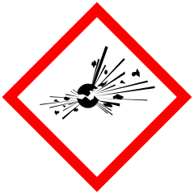                                | GHS01 | `.ghs-ghs01` | Explosive             | Physical        | Unstable explosives, divisions 1.1–1.6, self-reactive substances        |
| 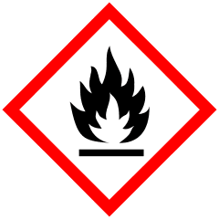                                | GHS02 | `.ghs-ghs02` | Flammable             | Physical        | Flammable gases, aerosols, liquids, solids, pyrophoric substances       |
| 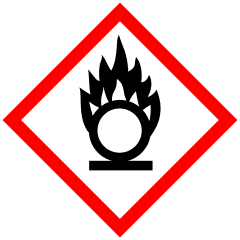                              | GHS03 | `.ghs-ghs03` | Oxidizing             | Physical        | Oxidizing gases, liquids, and solids                                    |
| 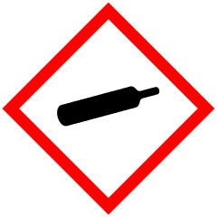                       | GHS04 | `.ghs-ghs04` | Compressed Gas        | Physical        | Compressed, liquefied, refrigerated, and dissolved gases                |
| 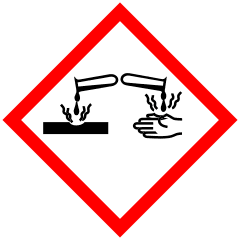                                  | GHS05 | `.ghs-ghs05` | Corrosive             | Physical/Health | Corrosive to metals; skin corrosion; serious eye damage                 |
| 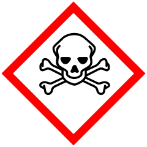                                           | GHS06 | `.ghs-ghs06` | Toxic                 | Health          | Acute toxicity categories 1–3                                           |
| 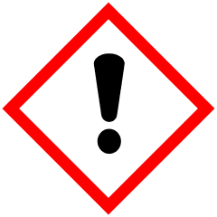     | GHS07 | `.ghs-ghs07` | Health Hazard         | Health          | Acute toxicity cat. 4; skin/eye irritation; sensitization; ozone hazard |
| 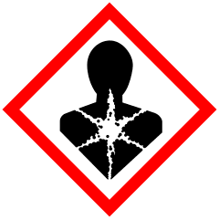        | GHS08 | `.ghs-ghs08` | Serious Health Hazard | Health          | Carcinogenicity, mutagenicity, reproductive toxicity, etc.              |
| 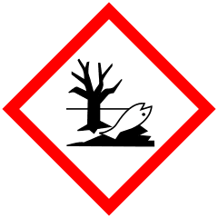 | GHS09 | `.ghs-ghs09` | Environmental Hazard  | Environmental   | Hazardous to aquatic environment                                        |

### Transport pictograms

#### Class 1 — Explosives

|                                                                                                                                                     | CSS Class      | Name                            |
| --------------------------------------------------------------------------------------------------------------------------------------------------- | -------------- | ------------------------------- |
| 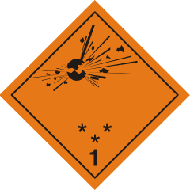     | `.ghs-adr-1`   | ADR Class 1 (Explosives)        |
| 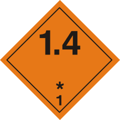 | `.ghs-adr-1-4` | ADR 1.4 (Low hazard explosives) |
| 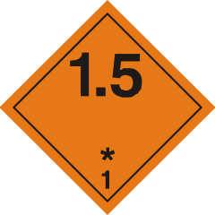 | `.ghs-adr-1-5` | ADR 1.5 (Very insensitive)      |
| 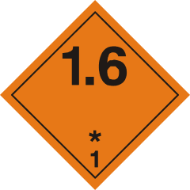 | `.ghs-adr-1-6` | ADR 1.6 (Extremely insensitive) |

#### Class 2 — Gases

|                                                                                                                                                | CSS Class      | Name                                   |
| ---------------------------------------------------------------------------------------------------------------------------------------------- | -------------- | -------------------------------------- |
| 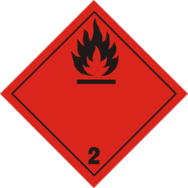 | `.ghs-adr-2-1` | ADR 2.1 (Flammable gas)                |
|  | `.ghs-adr-2-2` | ADR 2.2 (Non-flammable, non-toxic gas) |
| 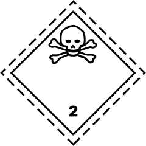 | `.ghs-adr-2-3` | ADR 2.3 (Toxic gas)                    |

#### Classes 3 & 4 — Flammable

|                                                                                                                                                                           | CSS Class    | Name                     |
| ------------------------------------------------------------------------------------------------------------------------------------------------------------------------- | ------------ | ------------------------ |
| 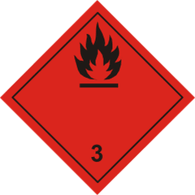 | `.ghs-adr-3` | ADR 3 (Flammable liquid) |

#### Other GHS transport classes

|                                                                                                                                                                                         | CSS Class           | Name                          |
| --------------------------------------------------------------------------------------------------------------------------------------------------------------------------------------- | ------------------- | ----------------------------- |
| 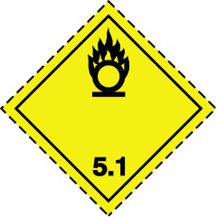                             | `.ghs-adr-5-1`      | ADR 5.1 (Oxidizing substance) |
| 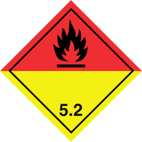 | `.ghs-un-5-2-black` | UN 5.2 (Organic peroxide)     |
| 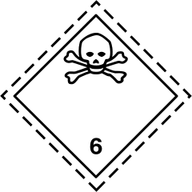             | `.ghs-un-6`         | UN Class 6 (Toxic/Infectious) |
| 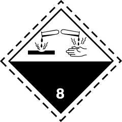             | `.ghs-un-8`         | UN Class 8 (Corrosive)        |

#### Non-GHS transport pictograms

|                                                                                                                                                              | CSS Class      | Name                                  |
| ------------------------------------------------------------------------------------------------------------------------------------------------------------ | -------------- | ------------------------------------- |
| 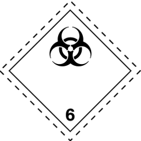 | `.ghs-adr-6-2` | ADR 6.2 (Infectious substance)        |
| 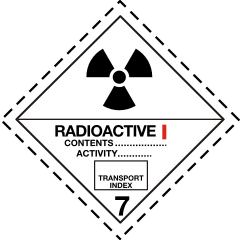   | `.ghs-adr-7a`  | ADR 7A (Radioactive I)                |
| 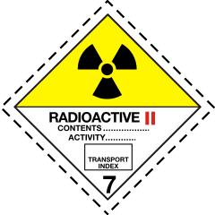   | `.ghs-adr-7b`  | ADR 7B (Radioactive II)               |
| 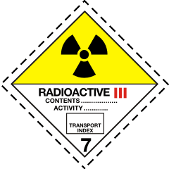   | `.ghs-adr-7c`  | ADR 7C (Radioactive III)              |
| 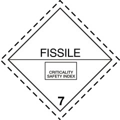   | `.ghs-adr-7e`  | ADR 7E (Fissile material)             |
|      | `.ghs-adr-9`   | ADR 9 (Miscellaneous dangerous goods) |

## Development

### Setup

```sh
yarn install
```

### Update pictograms

Re-scrapes Wikipedia, re-downloads SVGs, regenerates all assets and source files:

```sh
yarn update
```

### Build

```sh
yarn compile   # compile TypeScript to CJS + ESM
```

### Test

```sh
yarn test
```

### Lint CSS

```sh
yarn lint:css
```

### Format

```sh
yarn format
```

### Changelog

This project uses [changesets](https://github.com/changesets/changesets) for versioning:

```sh
yarn changeset        # create a new changeset
yarn changeset version # bump versions
yarn changeset publish # publish to npm
```

## License

MIT
